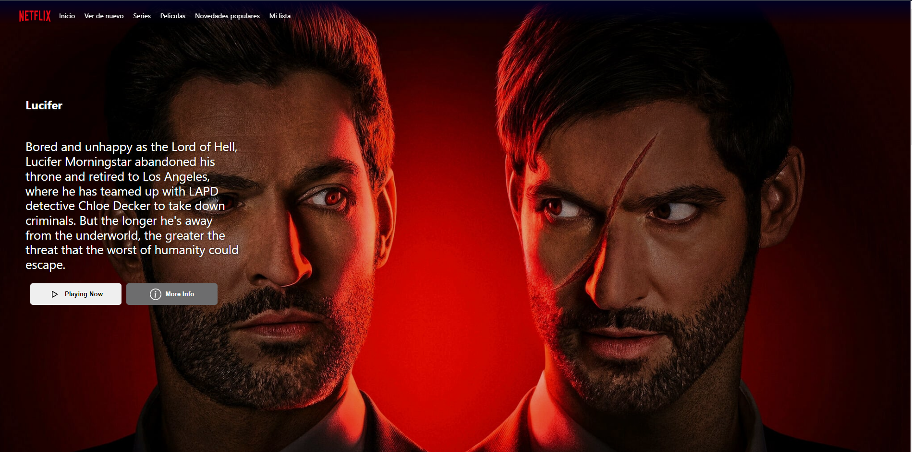
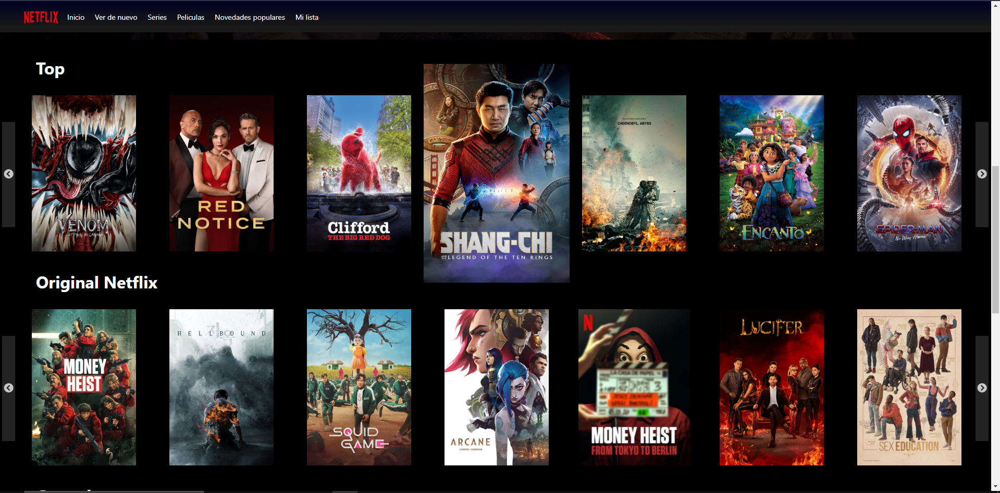
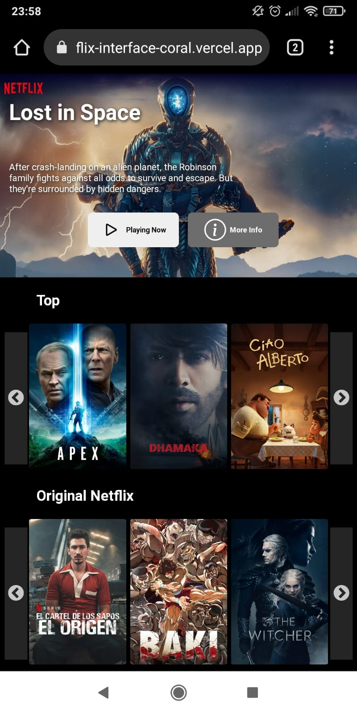

# Netflix App Getting Started with Create React App

Deploy https://netflix-interface-coral.vercel.app/

## The Movie Database API

Register in https://developers.themoviedb.org/3

## add .env file

REACT_APP_API_KEY={your_token_tmdb}

## Random Movie

## Sections

## Mobile

## Available Scripts

In the project directory, you can run:

### `yarn start`

Runs the app in the development mode.\
Open [http://localhost:3000](http://localhost:3000) to view it in the browser.

The page will reload if you make edits.\
You will also see any lint errors in the console.
